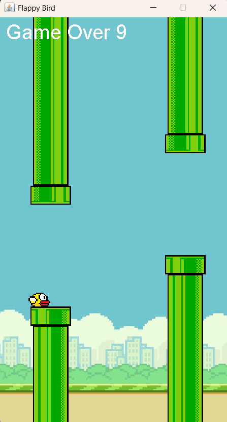

# Flappy Bird Game 🎮

A Java-based Flappy Bird game that brings the classic arcade fun to your desktop! Built using Core Java and Swing, this game offers realistic physics, smooth gameplay, and an interactive graphical interface.

---

## 🎯 Features

- **Core Java Implementation**: Developed using object-oriented programming (OOP) principles for clean and modular code.
- **Realistic Physics**: Includes gravity simulation, collision detection, and scoring mechanisms for an engaging gameplay experience.
- **Interactive GUI**: Built with Java Swing for a visually appealing and user-friendly interface.
- **Threading**: Ensures smooth gameplay and responsive user input.

---

## 🛠️ Technologies Used

- **Core Java**
- **Java Swing**

---

## 🚀 How to Run the Game

1. **Clone the Repository**:
   ```bash
   git clone https://github.com/ns2619/Flappy-Bird-Game.git 

2. **Navigate to the Project Directory**:
    ```bash
    cd flappy-bird-game

2. **Compile the Code**:
   ```bash
    javac -d bin src/*.java

3. **Run the Game**:
   ```bash
   java -cp bin Main

## 🎮 Gameplay Instructions 

1. Press the spacebar to make the bird jump.
2. Avoid hitting the pipes or falling off the screen.
3. Earn points by passing through the gaps in the pipes.
4. The game ends when the bird collides with a pipe or the ground.
5. To restart the game press enter

---

## 📂 Project Structure

```bash
flappy-bird-game/
├── src/
│   ├── App.java        // Entry point of the application
│   ├── FlappyBird.java        // Handles bird movement and properties
├── bin/                 // Compiled .class files
├── lib/              // dependencies  (optional)
└── README.md            // Project documentation
```

## 📸 Screenshots




<!--## 🤝 Contributing
Contributions are welcome! Feel free to fork this repository, make your changes, and open a pull request. 😊
-->
## 💡 Future Improvements
- Add background music and sound effects.
- Implement difficulty levels.
- Add a leaderboard to track high scores.

## 🙌 Acknowledgments
Inspired by the original Flappy Bird game. 
Thanks to the open-source community for their helpful resources!
